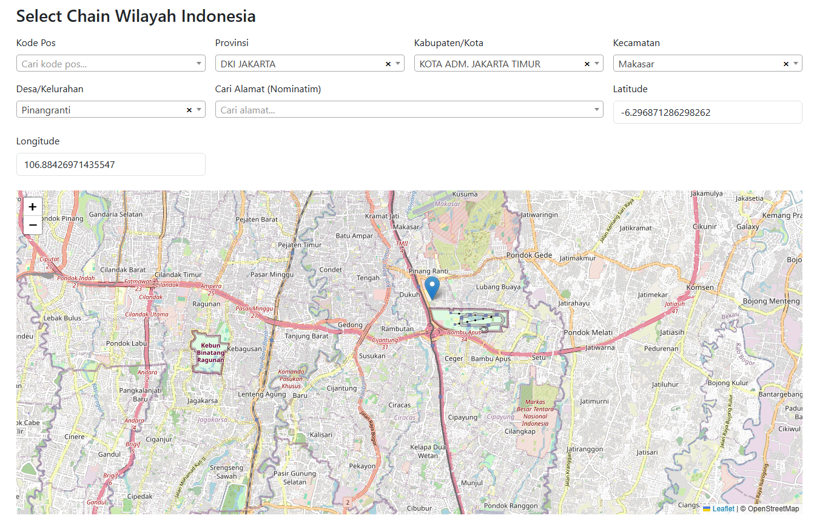

# Select Chain Wilayah Indonesia

Aplikasi web untuk pemilihan wilayah Indonesia secara berantai (Provinsi → Kabupaten/Kota → Kecamatan → Desa/Kelurahan) dengan Bootstrap, Select2 AJAX server-side, Leaflet JS, pencarian Kode Pos, serta integrasi Nominatim (autocomplete alamat dan reverse geocode). Pin peta dapat di-drag untuk menentukan koordinat akurat.

## Fitur
- Dropdown berantai dengan pencarian server-side (Select2 + PHP).
- Pencarian Kode Pos, otomatis mengisi seluruh chain wilayah.
- Peta Leaflet, marker dapat di-drag, otomatis mengisi lat/lng dan alamat.
- Autocomplete alamat via Nominatim, otomatis mengisi chain wilayah terdekat.

## Kebutuhan
- PHP 8+ dan MySQL/MariaDB (Laragon sesuai default).
- File data: `indonesia_regions.sql` di direktori proyek.

## Menjalankan

```bash
php -S localhost:8010 -t .
```

Lalu buka `http://localhost:8010/`.

## Konfigurasi Database
- Default: host `127.0.0.1`, user `root`, tanpa password, database `wilayah`.
- Bisa diubah via environment variables:
  - `DB_HOST`, `DB_USER`, `DB_PASS`, `DB_NAME`
- Jika tabel kosong, data akan diimpor otomatis dari `indonesia_regions.sql`.

## Endpoint Server
- `api.php?mode=postal&q=<query>&page=<n>&pageSize=<m>`: cari Kode Pos.
- `api.php?mode=chain&code=<kode_desa>`: ambil rantai wilayah dari kode desa.
- `api.php?mode=nearest&lat=<lat>&lng=<lng>`: rantai wilayah terdekat dari koordinat.
- Default (tanpa mode): `level`, `parent`, `q` untuk dropdown berantai.

## Alur Penggunaan
1. Pilih Kode Pos untuk otomatis mengisi Provinsi → Kabupaten/Kota → Kecamatan → Desa/Kelurahan dan memusatkan peta ke lokasi desa (zoom 18).
2. Seret pin di peta ke posisi yang diinginkan; lat/lng dan alamat akan terisi otomatis.
3. Alternatif: cari alamat dengan Nominatim, peta berpindah, chain wilayah diisi otomatis, dan lat/lng serta textarea alamat diperbarui.

## Screenshot



## Catatan
- Mohon menggunakan layanan Nominatim sesuai usage policy (rate-limit dan attribution).
- Data wilayah diambil dari file SQL yang disediakan; akurasi koordinat mengikuti data sumber.
